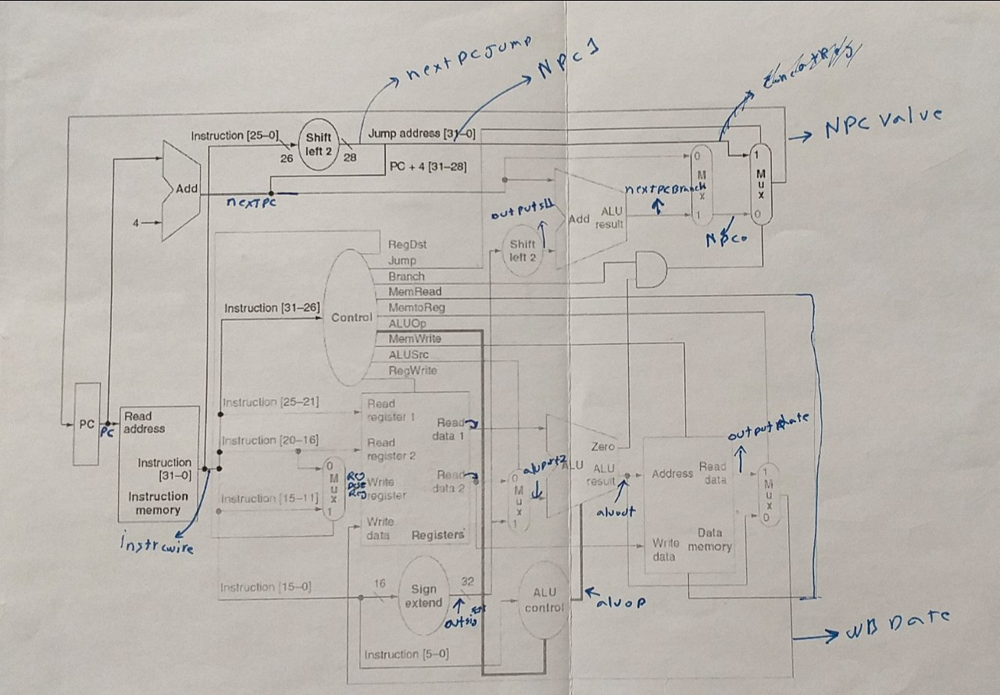
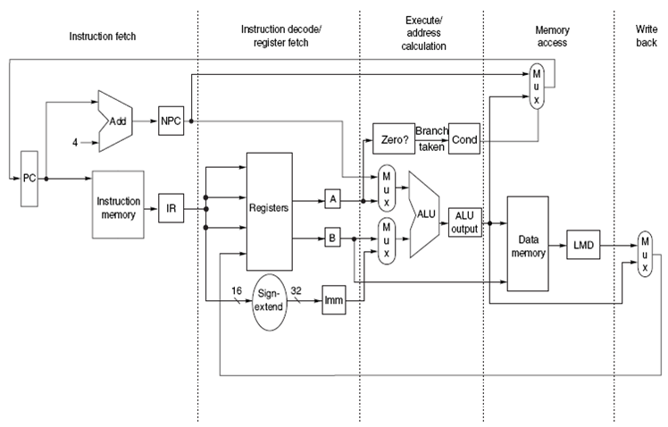

# MIPS pipline

A classic 5-stage pipeline MIPS 32-bit processor.

five stages of a microprocessor: instruction fetch (IF),
instruction decode (ID), execution(EX),
memory access and write (MEM) e write back (WB).

#name of wire and guideline
		

# states

support most of MIPS instruction and solve every hazard with stall.(Data Hazards and Control Hazards) Verilog code.

Developed during the winter 2019 Computer Architecture Laboratory course at the University of Ferdowsi Mashhad.

# Modular design
code start from mypip

other modular named same to original model
